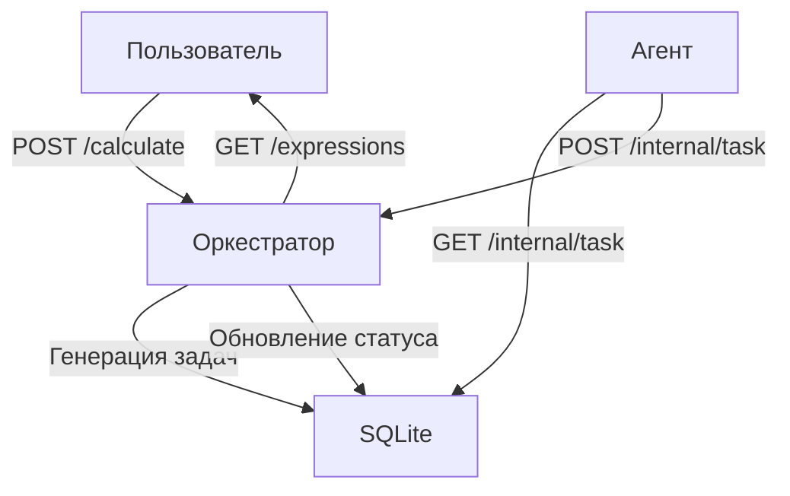

# Calc-LMS-5.1

**Calc-LMS-5.1** — распределённый вычислитель арифметических выражений с поддержкой пользователей и персистентности. Система позволяет отправлять выражения через API или веб-интерфейс, разбивает их на задачи, вычисляет асинхронно агентами и сохраняет всё в SQLite для восстановления состояния после перезагрузки.

## Функциональность

* **Регистрация и аутентификация пользователей**

  * `POST /api/v1/register` — регистрация нового пользователя (`login`, `password`).
  * `POST /api/v1/login` — вход пользователя, возвращает JWT-токен для авторизации последующих запросов.

* **API Оркестратора** (взаимодействие под JWT в заголовке `Authorization: Bearer <token>`):

  * `POST /api/v1/calculate` — отправка арифметического выражения для вычисления.
  * `GET /api/v1/expressions` — список выражений пользователя с их статусами и результатами.
  * `GET /api/v1/expressions/{id}` — подробная информация по конкретному выражению.
  * `GET /internal/task` — выдача задачи агенту.
  * `POST /internal/task` — приём результатов вычисленной задачи.

* **Агент (Worker)**

  * Запрашивает через `/internal/task` задачи на выполнение.
  * Исполняет операции (имитация задержки через настройки среды) и отправляет результат обратно в оркестратор.

* **Персистентность**

  * Хранение всех выражений, задач и пользователей в SQLite (файл `calc.db`).
  * Система восстанавливает состояние после перезагрузки.

* **Веб-интерфейс**

  * Простая HTML-страница (`web/index.html` + `web/main.js`), которая позволяет:

    * Зарегистрироваться и войти.
    * Отправлять выражения.
    * Просматривать список выражений с автоматическим обновлением (каждые 5 секунд).

* **Тесты**

  * Модульные и интеграционные тесты для оркестратора, разбора выражений, агентов

> Единственное я не успел перевести сервис на gRPC тк был в разъездах долгое время

## Структура проекта

```
calc-LMS-orchestrator/
├── cmd/
│   ├── calc/           # Оркестратор (сервер)
│   │   └── main.go
│   └── agent/          # Агент (демон)
│       └── main.go
├── go.mod
├── go.sum
├── integration_test.go # Интеграционные тесты
├── internal/
│   ├── api/v1/
│   │   ├── api.go       # API-эндпоинты для оркестратора и агентов
│   │   ├── login.go     # Логика обработки входа пользователей
│   │   └── register.go  # Логика обработки регистрации пользователей
│   ├── db/
│   │   └── db.go        # Работа с базой данных
│   ├── orchestrator/
│   │   ├── orchestrator.go         # Логика разбора выражений и генерации задач
│   │   └── orchestrator_test.go    # Тесты для оркестратора
│   └── server/
│       └── server.go    # HTTP-сервер с роутингом и отдачей статики (веб-интерфейс)
└── web/
    ├── index.html       # Веб-интерфейс
    ├── main.js          # Логика веб-интерфейса
    └── style.css        # Стили веб-интерфейса
```

## Установка

1. **Клонирование репозитория:**

   ```bash
   git clone https://github.com/yourusername/calc-LMS-5.1.git
   cd calc-LMS-5.1
   ```

2. **Обновление зависимостей:**

   ```bash
   go mod tidy
   ```

## Запуск системы

### Тестирование

Для запуска модульных тестов выполните из корневой директории:

```bash
go test ./internal/orchestrator/... -v
```

### Запуск оркестратора (сервера)

Запустите сервер из корневой директории, используя команду:

```bash
go run cmd/calc/main.go
```

Сервер будет запущен на порту **8080** и отдавать как API, так и веб-интерфейс.

### Запуск агента (демона)

В отдельном терминале запустите его:

```bash
go run cmd/agent/main.go
```

### Доступ к веб-интерфейсу

После запуска оркестратора откройте браузер и перейдите по адресу:

```
http://localhost:8080
```

Веб-интерфейс — позволяет пользователю зарегистрироваться, войти, отправить выражение и отслеживать его статус и результат в реальном времени.

## Примеры использования (curl)

> Все запросы к защищённым ресурсам должны содержать JWT в заголовке:
> `Authorization: Bearer <token>`

Я делал запросы в gitBash, там принимаются многоуровневые запросы

1. **Регистрация пользователя**

    ```bash
    curl -X POST http://localhost:8080/api/v1/register \
      -H 'Content-Type: application/json' \
      -d '{"login":"user1", "password":"pass123"}'
    ```

2. **Вход и получение токена**

   ```bash
   curl -X POST http://localhost:8080/api/v1/login \
     -H 'Content-Type: application/json' \
     -d '{"login":"user1","password":"pass123"}'
   # В ответ: {"token":"eyJ..."}
   ```

3. **Отправка выражения на вычисление**

   ```bash
   curl -X POST http://localhost:8080/api/v1/calculate \
     -H 'Content-Type: application/json' \
     -H 'Authorization: Bearer <token>' \
     -d '{"expression":"2+2*2"}'
   ```

4. **Получение списка выражений**

   ```bash
   curl http://localhost:8080/api/v1/expressions \
     -H 'Authorization: Bearer <token>'
   ```

5. **Получение информации по выражению**

   ```bash
   curl http://localhost:8080/api/v1/expressions/1 \
     -H 'Authorization: Bearer <token>'
   ```

## Как это работает



## Дополнительная информация

- **Логирование:**  
  В консоли оркестратора и агента выводятся сообщения о ходе выполнения задач, что позволяет отследить работу системы. 

- **Конфигурация:**  
  Значения времени выполнения операций задаются через переменные окружения (например, `TIME_ADDITION_MS` и т.д.) — в данном примере установлены фиксированные значения.

> по вопросам писать в тг: @prud_official
